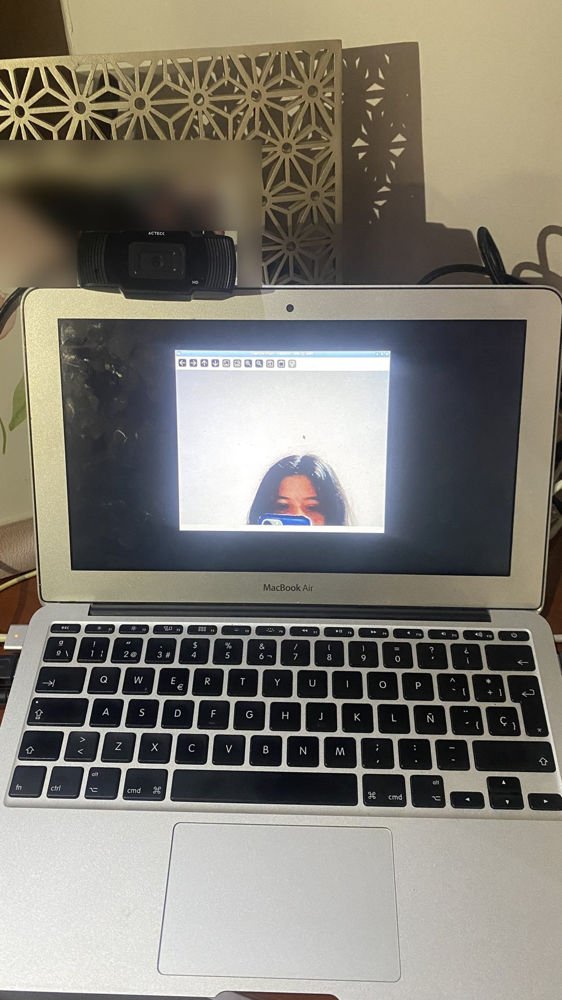

# EDG-1 — Laptop edge lista y captura con webcam

**Criterio del ticket:** en la laptop edge, instalando solo con las instrucciones escritas,
el programa muestra la cámara y guarda una foto al presionar la tecla.

Instrucciones seguidas: [`edge/README.md`](../../edge/README.md), desde un clon nuevo del
repositorio en la laptop edge, el 2026-10-09.

## Vista previa en la pantalla del equipo



Foto tomada con un celular: la MacBook Air con Ubuntu Server, la webcam USB Acteck HD
conectada arriba y la ventana de `capture.py` con la cámara en vivo, arrancada con
`run_display.sh` desde la consola física. El retrato del fondo se difuminó.

## Fotos guardadas por el programa

Guardadas por `capture.py` al presionar la barra espaciadora (640×480, JPEG):

| Archivo | Modo |
|---|---|
| `capturas/capture_20261009_032055_046.jpg` | Sin ventana, por SSH |
| `capturas/capture_20261009_032057_067.jpg` | Sin ventana, por SSH |
| `capturas/capture_20261009_040159_796.jpg` | Con vista previa (`run_display.sh`) |
| `capturas/capture_20261009_040204_741.jpg` | Con vista previa (`run_display.sh`) |

Las horas del nombre son UTC, la zona del equipo.

## Datos del equipo (`python device_info.py`)

```
Marca y modelo    : Apple Inc. MacBookAir6,1 1.0
Procesador        : Intel(R) Core(TM) i5-4260U CPU @ 1.40GHz
Nucleos           : 2 fisicos, 4 logicos
Memoria RAM       : 3.3 GiB (memoria que ve el sistema)
Sistema operativo : Ubuntu 26.04.1 LTS (kernel 7.0.0-38-generic, x86_64)
Camaras           : /dev/video0: Integrated Camera: Integrated C; /dev/video1: Integrated Camera: Integrated C
Version de Python : 3.14.4
```

La cámara es una Acteck HD USB (chip IMC Networks `13d3:784b`); el nombre "Integrated
Camera" es el que anuncia su firmware. `/dev/video1` es un segundo nodo de la misma cámara.

Dependencias instaladas en el entorno virtual (`pip freeze`):

```
numpy==2.3.5
opencv-python==4.13.0.92
PyYAML==6.0.3
```
