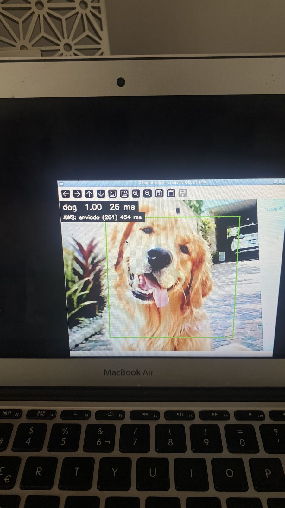
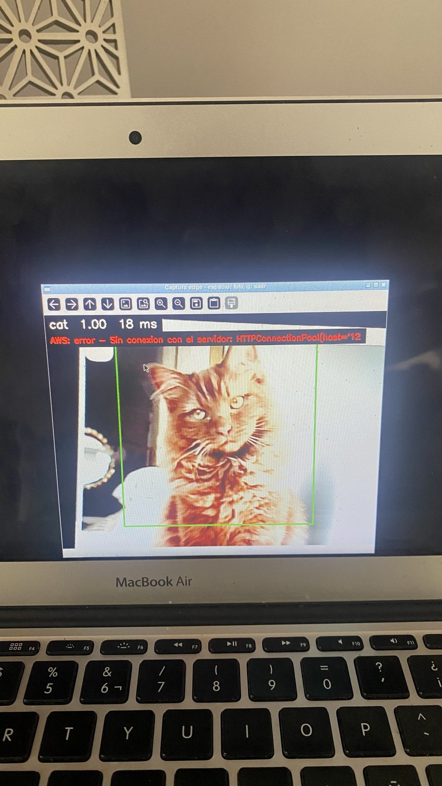

# EDG-4 — Envío a AWS con fallo controlado y reintento sin duplicados

**Criterio del ticket:** una captura llega a AWS; con el envío fallando a propósito se ve el
error; al reintentar llega con el mismo ID y existe un solo registro.

Código: [`edge/sender.py`](../../edge/sender.py), [`edge/retry.py`](../../edge/retry.py) y el
envío en segundo plano de [`edge/capture.py`](../../edge/capture.py); prueba
[`edge/tests/test_sender.py`](../../edge/tests/test_sender.py). Uso: "Envío a AWS" en
[`edge/README.md`](../../edge/README.md).

Todo en la laptop edge el 2026-10-10 (horas en UTC), con el INT8 oficial, contra el endpoint
real `http://18.216.36.30/api/edge-captures`. La clave del dispositivo vive solo en la laptop
(`~/.config/edge/device.env`, permisos 600) y no aparece en ningún archivo de esta carpeta.

## 1. Una captura llega a AWS

Captura por SSH con una foto de un perro frente a la cámara:

```
Historial:   /home/steph/Proyecto4-team2/edge/events.db (0 eventos)
Dispositivo: edge-macbookair-01
Envio:       http://18.216.36.30/api/edge-captures (clave: /home/steph/.config/edge/device.env)
Camara 0 lista. Las fotos se guardan en /home/steph/Proyecto4-team2/edge/captures
Modo sin ventana (no hay pantalla). Espacio: foto y clasificacion. q: salir.
Foto guardada: .../captures/capture_20261010_204009_019_3f133f76-a066-4886-810f-e98e8c0cd0d1.jpg
  Clase: dog  confianza: 0.9402  tiempo: 26.1 ms (preprocesamiento + inferencia)
  Evento: 3f133f76-a066-4886-810f-e98e8c0cd0d1  2026-10-10T20:40:09.019+00:00  estado: pendiente
  Envio 3f133f76-a066-4886-810f-e98e8c0cd0d1: enviado (HTTP 201, nuevo, 417 ms)
```

Después, desde la ventana en la pantalla de la laptop (`run_display.sh`), dos perros más
llegaron igual (201). La ventana muestra el envío en la segunda línea:



Los 454 ms de la ventana son el `send_ms` que quedó en el historial para `cb0c3f00`; se
guardan aparte de `latency_ms` (26 ms de preprocesamiento + inferencia).

## 2. Fallo a propósito: se ve el error

`run_display.sh --simular-fallo` manda los envíos a `http://127.0.0.1:9`, donde nada escucha;
no cambia `config.yaml` ni toca el servidor. Con un gato en el recuadro:



La clasificación se hizo igual (`cat 1.00`) y el evento quedó en `error` con el motivo:

```
35c32b15-a6a1-4bda-a8d7-6f76bbefd0e0  cat  0.9998  error
send_error: Sin conexion con el servidor: HTTPConnectionPool(host='127.0.0.1', port=9): ...
            [Errno 111] Connection refused
```

## 3. Reintento con el mismo ID: un solo registro

```
$ python retry.py 35c32b15-a6a1-4bda-a8d7-6f76bbefd0e0   # paso 3
35c32b15-a6a1-4bda-a8d7-6f76bbefd0e0  cat  enviado (HTTP 201, nuevo, 386 ms)
  En AWS: capture_id 35c32b15-a6a1-4bda-a8d7-6f76bbefd0e0, received_at 2026-10-10T20:49:55.000Z, image_key edge-captures/35c32b15-a6a1-4bda-a8d7-6f76bbefd0e0.jpg

$ python retry.py 35c32b15-a6a1-4bda-a8d7-6f76bbefd0e0   # paso 4, otra vez
35c32b15-a6a1-4bda-a8d7-6f76bbefd0e0  cat  enviado (HTTP 200, ya existia, 333 ms)
  En AWS: capture_id 35c32b15-a6a1-4bda-a8d7-6f76bbefd0e0, received_at 2026-10-10T20:49:55.000Z, image_key edge-captures/35c32b15-a6a1-4bda-a8d7-6f76bbefd0e0.jpg
```

El segundo envío devolvió 200 con el mismo `received_at`: el servidor ya tenía ese
`capture_id` y no creó otro registro. El registro en AWS está en
[`aws_gato_35c32b15.json`](aws_gato_35c32b15.json) (`GET /api/edge-captures/<id>`, sin la URL
temporal de la foto).

## 4. Historial local contra AWS

Se recorrió la lista completa del portal (`GET /api/edge-captures`, 7 capturas en total; las
otras 3 son pruebas de AWS-1/AWS-2) y se comparó cada evento del historial local
([`eventos_local.json`](eventos_local.json), de `export_events.py`):

| capture_id | Clase | Registros en AWS | Metadatos local = AWS | received_at |
|---|---|---|---|---|
| `3f133f76…` | dog | 1 | sí | 2026-10-10T20:40:09Z |
| `ce5f9611…` | dog | 1 | sí | 2026-10-10T20:43:41Z |
| `35c32b15…` | cat | 1 | sí | 2026-10-10T20:49:55Z |
| `cb0c3f00…` | dog | 1 | sí | 2026-10-10T20:46:53Z |

"Metadatos" = clase, confianza, `latency_ms`, `device_id`, `model_version`, `crop`, `image_key`
y `captured_at` (el servidor la guarda en UTC con `Z`; es el mismo instante). Las fotos de las
cuatro capturas están en [`capturas/`](capturas/), con el `capture_id` en el nombre.

`received_at` tiene precisión de segundos en el servidor, por eso la del primer perro
(20:40:09.000) aparece unos milisegundos antes que `captured_at` (20:40:09.019).

## Rechazo 401 con una clave incorrecta

Antes de configurar la clave real se probó contra el servidor real con una clave incorrecta a
propósito (`EDGE_DEVICE_KEY=clave-incorrecta-a-proposito`). El servidor rechaza antes de leer
la foto, así que no se guardó nada:

```
  Envio 425d6cc7-0bd2-42d0-90e5-89ac857d68b7: error: HTTP 401: Clave de dispositivo ausente o incorrecta (encabezado X-Device-Key). No se reintenta solo.
```

Los rechazos 400 y 401 quedan fuera de `retry.py --todos` (solo con `--incluir-rechazados`):
reenviar el mismo dato o la misma clave no los arregla.

## Pruebas

`python -m unittest discover -s tests -v -b`: 18/18 en la laptop edge y en una Mac.
`test_sender.py` usa un servidor local que imita el endpoint y cubre: campos, foto y clave
enviados; `enviado` con `received_at` e `image_key` sin tocar `latency_ms`; fallo de red →
reintento 201 → repetición 200 con un solo registro; 401 permanente; tiempo de espera; falta
de clave; y que el envío en segundo plano no bloquea la captura.
